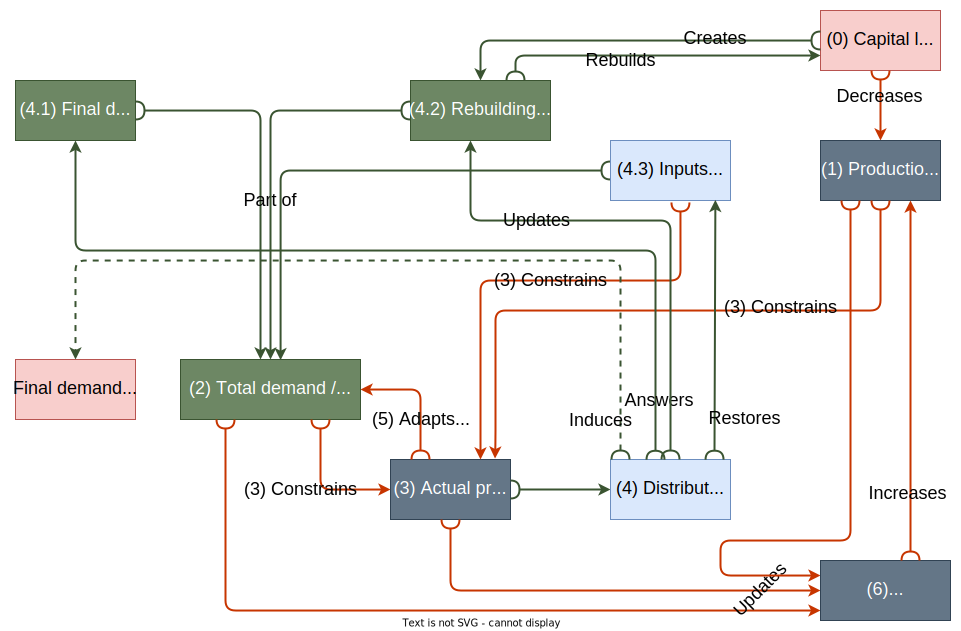

.. _boario-math:

###################################
Model description
###################################

Background and overview
=======================

Adaptive Regional Input-Output (ARIO) is an I-O model, designed to compute indirect
costs from exogenous shocks. Its first version dates back to 2008 and has originally
been developed to assess the indirect costs of natural disasters :cite:`2008:hallegatte`.
In this paper we present BoARIO, a generic python implementation, similar to the one
described in :cite:`2013:hallegatte` with some additions (e.g. inspired by :cite:`2020:guan`).

The economy is modelled as a set of economic sectors and a set of regions.
In the following, we call an industry a specific (sector, region) couple.
Each economic sector produces its generic product and draws inputs from an inventory.
Each industry answers to a total demand consisting of a final demand
(household consumption, public spending and private investments) coming from all
regions (i.e. both local demand and exports), intermediate demand (inventory resupply).
An initial equilibrium state of the economy is built based on multi-regional
input-output tables (MRIO tables). Apart from parameters specific to the MRIOT
region-sector typology, BoARIO supposedly handles any MRIOT in the same manner.

Multiple kinds of shocks can be implemented:

* On the production capacity directly (one or multiple industries are arbitrarily
  forced to produce less)
* On the productive capital (one or multiple industries arbitrarily
  lose some part of their factors of production and are thus forced to both
  produce less and to build back their capital stock).
* On the households (households of affected regions lose some part of their goods and
  seek to get them back).

The model then describes how exogenous shocks propagates across the economy at each
time step (a day in this study): the imbalance between production and demand is
resolved by a proportional rationing scheme, which then leads some industries and
households to not receive the totality of their orders. Industries can buffer
these unfilled orders with their “inventories” of input and increase or shift
their resupply demand. Currently, households simply register the loss as
final consumption not met and do not postpone their demand. During the simulation,
industries adjust their production and orders based on both demand and their inventories.

Direct economic impact consists in the valuation of the initial exogenous shock,
while total economic impact includes also indirect costs consequent to the propagation.

Total economic impact can be measured in two ways:

* Final demand not met, i.e. goods that households couldn’t buy due to rationing.
* Relative production change, i.e. diminished or increased production of industries relative to their initial production.

.. _boario-math-notations:

Notations
===========

.. include:: notation_table.rstinc

.. note::

  We use sets of indices for industries, sectors and regions to simplify the notation of matrix elements.
  As such we use both :math:`\sum_{f' \in \firmsset} (z_{ff'})` and :math:`\sum_{1 \leq f' \leq p} (z_{ff'})`
  to designate the sum of all flows from industry :math:`f` (resp. indexed by :math:`f`) to other industries.

.. note::

  Additionally, we use :math:`A = B \odot C`, the Hadamard product (element wise product) (i.e. :math:`a_{ij} = b_{ij} \cdot c_{ij}`)

Mathematical formalism
=======================

.. _boario-math-init:

Initial state
--------------

The initial state refers to an economic equilibrium before any exogenous shocks. Initial values for intermediate orders :math:`\ioorders`, final consumption :math:`\ioy`, and production :math:`\iox` are derived from MRIO tables. Inventories :math:`\ioinv` are stocks of inputs an industry can draw into and :math:`\ioinv(t=0)` is initialized using the initial intermediate orders :math:`\ioorders(0) = \ioz` : by default, it is assumed that every industry has :math:`\mathbf{s}` days of inputs ahead in their stocks.

Initial production :math:`\iox_0`, technical matrix :math:`\ioa` and
value added technical matrix :math:`\ioava` are consistent with Leontief I-O theory:

.. math::
   :nowrap:

    \begin{gather*}
    \iox_0 = \ioz \cdot \mathbf{i} + \ioy \cdot \mathbf{i}\\
    \ioa = \ioz \cdot \mathbf{\hat{x}}_0^{-1}\\
    \ioava = \ioy \cdot \mathbf{\hat{x}}_0^{-1}
    \end{gather*}

Where:

* :math:`\mathbf{i}` is a summation column vector of size :math:`s \times r` (number of sectors times regions)
* :math:`\mathbf{\hat{x}_0}` is the diagonal matrix with the elements of :math:`\iox_0`

.. note::

   We divide these yearly values by the ``iotable_year_to_temporal_unit_factor`` :ref:`parameter <year_to_temporal_unit_factor>` in order to obtain an approximation of the productions and demands per :ref:`temporal unit<temporal>` (most often days).

We also require technology and transactions information at the sector level,
regardless of the region of provenance, so we compute the following :

.. _boario-math-z-agg:

.. math::
   :nowrap:

   \begin{gather*}
    \ioa^{\sectorsset} = \mathbf{I_{\textrm{sum}}} \cdot  \ioa\\
    \ioz^{\sectorsset} = \mathbf{I_{\textrm{sum}}} \cdot  \ioz\\
    \ioz^{\textrm{Share}} =  \ioz \oslash \left ( \ioz^{\sectorsset} \otimes \underbrace{\begin{bmatrix} 1 \\ \vdots\\ 1 \end{bmatrix}}_{\text{m-sized}} \right )
   \end{gather*}

Where :

* :math:`\mathbf{I_{\textrm{sum}}}` is a row summation matrix which aggregates by sector.

.. math::

    \mathbf{I_{\textrm{sum}}} =
    \underbrace{
        \begin{bmatrix}
          1 & \cdots & 0 & & 1 & \cdots & 0 \\
          \vdots & \ddots & \vdots & \cdots & \vdots & \ddots & \vdots \\
          0 & \cdots & 1 & & 0 & \cdots & 1
        \end{bmatrix}
      }_{r \times s} s

.. note::

   :math:`\otimes` is the Kronecker product which repeats each row of :math:`\ioz^{\sectorsset}` :math:`m` times.

   :math:`\oslash` is the matrix element-wise division, defined such that dividing by zero gives zero. (If initial order to an industry was null, the share ordered is also null)

Hence, :math:`\ioa^{\sectorsset}` and :math:`\ioz^{\sectorsset}` are respectfully the technical matrix and the intermediate demand matrix, that are aggregated by sector.

:math:`\ioz^{\textrm{Share}}` represents for each firm and for each of their input, the share of the total ordered to a supplier, initially (i.e. :math:`\ioz` normalized for each input). Or alternatively, the initial "market shares".

.. _boario-math-initial-inv:

As stated previously, the initial inventory matrix :math:`\ioinv` is initialized as follows :

.. math::
   :nowrap:

    \begin{equation*}
      \ioinv(t=0) = \mdefentryval{\omega}{0}{i}{n}{f}{p}{}{} =
      \begin{bmatrix}
      \mathbf{s} \cdots \mathbf{s}
      \end{bmatrix}
      %% \colvec{s_1 \cdots s_1}{s_n \cdots s_n}
      \odot \underbrace{
      \begin{bmatrix} \iox(0)\\
      \vdots\\
      \iox(0) \end{bmatrix}}_{\substack{\iox(0)\\
      n\text{ times}}} \odot \ioa^{\sectorsset} = \colvec{s_1 x_1(0) a_{11} \cdots s_1 x_{p}(0) a_{1p}}{s_n x_{1}(0) a_{n1} \cdots s_n x_{p}(0) a_{np}}
    \end{equation*}

Such that :math:`\omega_{if}(0) = s_i \cdot x_{f}(0) \cdot a_{if}` is the
exact amount of product :math:`i` required by industry :math:`f` to produce
:math:`x_{f}(0)` (i.e. the initial equilibrium production of :math:`f`) during :math:`s_i` temporal units. Or, alternatively, that :math:`f` could (technically) produce during :math:`s_i` temporal units without receiving input from any industry producing :math:`i`.

As such, all industries start with a stock of each of their intermediate inputs equal to the amount required for :math:`s_i` temporal units of production at initial production capacity.

.. note::

  At the moment :math:`s_i` does not differ on a per-industry basis, only on a per-product basis.

The order matrix :math:`\ioorders` is initialized to be equal to :math:`\ioz` :

.. math::
   :nowrap:

    \begin{equation*}
        \ioorders(t=0) = \left ( o_{ff'}(t=0) \right )_{\substack{f
        \in \rfirmsset{R}\\f'
        \in \rfirmsset{R'}\\(R,R') \in \regionsset}} = \ioz
    \end{equation*}

And where :math:`o_{ff'}` is the order made by firm :math:`f'` to firm :math:`f`.

.. _boario-math-dyn:

Model dynamics
-----------------

.. _boario-math-prod:

Production module
^^^^^^^^^^^^^^^^^^^^

In ARIO, production is demand-driven, which means production cannot be greater than demand. Another limit is the production capacity, which can change (positively or negatively) either due to a shock (e.g. productive capital destroyed) or due to the overproduction mechanism. Finally production can be constrained by the state of the inventory of inputs of an industry, the general philosophy being that industries will aim to have enough inputs to produce at their current production level for a given number of days, reducing their production level if that is not the case.

Here is how, at each temporal unit :math:`t`, the vecto of actual (or realised) production for each industry :math:`f \in \firmsset`, denoted  :math:`\iox^a(t)`, is computed in BoARIO:

Let :math:`\mathbf{\alpha} = (\alpha_{f})_{f \in \firmsset}` be the vector of overproduction such that :math:`\alpha_{f}` is the overproduction factor of industry :math:`f` and let :math:`\Delta_{f}(t)` be the initial loss of production capacity of industry :math:`f_S^R` :
Production capacity of industry :math:`f` at step :math:`t` before constraints is:

.. math::
   :nowrap:

    \begin{equation*}
      x^{Cap}_{f}(t) = \alpha_{f}(t) (1 - \Delta_{f}(t)) x_{f}(t)
    \end{equation*}

Once we have production capacity, we can compute actual production:

.. math::
   :nowrap:

    \begin{alignat*}{4}
          \mathbf{D}^{\textrm{Tot}}(t) &= (d_{f}^{\textrm{Tot}}(t))_{f \in \firmsset} &&= \ioorders(t) \cdot \irowsum + \ioy \cdot \irowsum + \Damage_{\firmsset} \cdot \tau_{\textrm{REBUILD}} && \text{Total demand matrix} \\
          & && &&\\
          \iox^{\textrm{Opt}}(t) &= (x^{\textrm{Opt}}_{f}(t))_{f \in \firmsset} &&= \left ( \min \left ( d^{\textrm{Tot}}_{f}(t), x^{\textrm{Cap}}_{f}(t) \right ) \right )_{f \in \firmsset} && \text{Optimal production}\\
          & && &&\\
          \ioinv^{\textrm{Cons}}(t) &= (\omega^{\textrm{Cons},f}_p(t))_{\substack{p \in \sectorsset\\f \in \firmsset}} &&=
             \begin{bmatrix}
               s^{1}_1 & \cdots & s^{p}_1 \\
               \vdots & \ddots & \vdots\\
               s^1_n & \cdots & s^{p}_n
             \end{bmatrix}
    \odot \begin{bmatrix} \iox^{\textrm{Opt}}(t)\\
    \vdots\\
    \iox^{\textrm{Opt}}(t) \end{bmatrix} \odot \ioa^{\sectorsset} \cdot \psi && \\
    &&&= \begin{bmatrix}
    s^{1}_1 x^{\textrm{Opt}}_{1}(t) a_{11} & \cdots & s^{p}_1 x^{\textrm{Opt}}_{p}(t) a_{1p}\\
    \vdots & \ddots & \vdots\\
    s^1_n x^{\textrm{Opt}}_{1}(t) a_{n1} & \cdots & s^{p}_n x^{\textrm{Opt}}_{p}(t) a_{np}
    \end{bmatrix}
    \cdot \psi && \text{Inventory constraints}  \\
    & && &&\\
          \iox^{a}(t) &= (x^{a}_{f}(t))_{f \in \firmsset} &&= \left \{ \begin{aligned}
                                                                          & x^{\textrm{Opt}}_{f}(t) & \text{if $\omega_{p}^f(t) \geq \omega^{\textrm{Cons},f}_p(t)$} \forall p\\
                                                                          & x^{\textrm{Opt}}_{f}(t) \cdot \min_{p \in \sectorsset} \left ( \frac{\omega^s_{p}(t)}{\omega^{\textrm{Cons,f}}_p(t)} \right ) & \text{if $\omega_{p}^f(t) < \omega^{\textrm{Cons},f}_p(t)$}
                                                                       \end{aligned} \right. \quad && \text{Actual production at $t$}
    \end{alignat*}

First we compute the total demand directed towards each industry with **Eq.** :math:`\text{Total demand matrix}`.
Then we compute optimal production without inventory constraints for each industry as the minimum between
production capacity (possibly reduced by damages) and total demand, assuming an industry will not produce more
than its clients demand (**Eq.** :math:`\text{Optimal production}`).

We define inventory constraints :math:`\ioinv^{\textrm{Cons}}` for each input, as a share :math:`\psi` of the amount
of stocks required to produce :math:`s_p^f` temporal units of production at the level of production of the previous
step (**Eq.** :math:`\text{Inventory constraints}`).

.. seealso::

   You can take a look at the documentation of the method
   here: :py:meth:`~boario.extended_models.ARIOPsiModel.calc_production`
   (as well as the source code, via the ``source`` button)

.. hint::

  :class:`ARIOBaseModel` offers a simplified version of the model where :math:`\psi = 1` (among other simplifications).

If the inventory of product :math:`p \in \sectorsset` of an industry :math:`f` is lower than its required level,
then :math:`f`'s production is reduced. An inventory shortage of :math:`x` % (w.r.t. its constraint) leads to
a :math:`x` % reduction of production.

.. _boario-math-distrib:

Distribution and inventory module
^^^^^^^^^^^^^^^^^^^^^^^^^^^^^^^^^^^^^^^

The distribution module defines how actual production is allocated towards the various demands:

If :math:`d_f^{\textrm{Tot}}(t) = x_f(t)`, each client receive their order. If :math:`d_f^{\textrm{Tot}}(t) > x_f(t)`,
each client receive a share of their order as per a proportional rationing scheme:

.. math::
   :nowrap:

    \begin{alignat*}{4}
      &\ioorders^{\textrm{Received}}(t) &&= \left (\frac{o_{ff'}(t)}{d^{\textrm{Tot}}_f(t)} \cdot x^a_f(t) \right )_{f,f'\in \firmsset}\\
      &\ioy^{\textrm{Received}}(t) &&= \left ( \frac{y_{f}}{d^{\textrm{Tot}}_f(t)}\cdot x^a_f(t) \right )_{f\in \firmsset}\\
      &\Damage^{\textrm{Repaired}}(t) &&= \left ( \frac{\gamma_{f} \cdot \tau_{\textrm{REBUILD}}}{d^{\textrm{Tot}}_f(t)} \cdot x^a_f(t) \right )_{f\in \firmsset}\\
    \end{alignat*}

Where :math:`\damage_f` is the total rebuilding demand towards industry :math:`f` and
:math:`\tau_{\textrm{REBUILD}}` is the rebuilding characteristic time.

Inventory resupply
__________________

From the received orders (or answered intermediate demand), the model can infer the changes in inputs inventories:

.. math::
   :nowrap:

    \begin{alignat*}{4}
      &\ioinv(t+1) &&= \ioinv(t) + \underbrace{\left ( \mathbf{I}_{\textrm{sum}} \cdot \ioorders^{\textrm{Received}}(t) \right )}_{\text{orders received aggregated by inputs}} - \underbrace{\left ( \colvec{\iox^{\textrm{a}}(t)}{\iox^{\textrm{a}}(t)} \odot \ioa^{\sectorsset} \right )}_{\text{inputs used during production}}\\
    \end{alignat*}

.. _boario-math-recovery:

Recovery
__________

.. math::
   :nowrap:

    \begin{equation*}
      \Damage_{\textrm{Tot}}(t+1) = \Damage_{\textrm{Tot}}(t) - \Damage^{\textrm{Repaired}}(t)
    \end{equation*}

.. seealso::

   You can take a look at the documentation of the method here: :py:meth:`~boario.model_base.ARIOBaseModel.distribute_production` (as well as the source code, via the ``source`` button)

.. _boario-math-orders:

Order module
^^^^^^^^^^^^^^

After distribution, the model can compute the orders made by each industries towards their suppliers in order
to resupply their inventories of inputs.

Industries seek to restore the inventory of each of their input to their goal level, that is the initial
level w.r.t. its current optimal production level (see :ref:`boario-math-prod`).

.. attention::

  As such, this goal can vary during simulation as it depends on :math:`\iox^{\textrm{Opt}}_t` (and not :math:`\iox_0`).

.. note::

  In :class:`ARIOBaseModel`, the total order matrix is simply the difference between :math:`\ioinv^{*}(t)` and
  :math:`\ioinv(t)`, whereas in :class:`ARIOPsiModel`, only a fraction of missing inventories are ordered,
  but in addition, the totality of inputs used for production during this step is also ordered.
  This difference is highlighted in red in the next equations (the red part is added in the ``ARIOPsiModel`` case)

.. math::
   :nowrap:

    \begin{alignat*}{4}
       &\ioinv^{*}(t) &&= (\omega_p^{*,f}(t))_{\substack{p \in \sectorsset\\f \in \firmsset}} \quad = \quad s^{f}_p \cdot \begin{bmatrix} \iox^{\textrm{Opt}}(t)\\ \vdots\\ \iox^{\textrm{Opt}}(t) \end{bmatrix} \odot  \ioa^\sectorsset && \quad && \text{Inventory goals} \\
       &\ioinv^{\textrm{Gap}}(t) &&= (\omega_p^{\textrm{Gap},f}(t))_{\substack{p \in \sectorsset\\f \in \firmsset}} \quad = \quad \left ( \ioinv^{*} - \ioinv(t) \right )_{\geq 0} && \quad && \text{Inventory gaps}\\
       &\ioorders^{\sectorsset}(t) &&= {\color{red}{\frac{1}{\tau_{\textrm{Inv}}}}} \cdot \ioinv^{\textrm{Gap}}(t) {\color{red}{ + \begin{bmatrix} \iox^a(t)\\ \vdots\\ \iox^a(t) \end{bmatrix} \odot  \ioa^{\sectorsset}}} &&\quad && \text{Intermediate demand total orders}\\
       &\ioorders(t) &&= \left ( \ioorders^{\sectorsset}(t) \otimes \underbrace{\begin{bmatrix} 1 \\ \vdots\\ 1 \end{bmatrix}}_{\text{m-sized}} \right ) \odot  {\color{green}{\ioz^{\textrm{*}}}} &&\quad && \text{Intermediate demand orders}
    \end{alignat*}

#. In **Eq.** :math:`\text{Inventory goals}` we compute inventory goals based on optimal production. (Note that, in the version with ``psi``, :math:`\Omega^* = \frac{\Omega^{\textrm{Cons}}}{\psi}`)
#. In **Eq.** :math:`\text{Inventory gaps}` we compute the inventory gaps. :math:`(\mathbf{A} - \mathbf{B})_{\geq 0}` denotes the resulting matrix of :math:`\mathbf{A} - \mathbf{B}` where negative values are replaced by 0.
#. In **Eq.** :math:`\text{Intermediate total demand orders}` we compute aggregate orders for intermediate demand.
#. In **Eq.** :math:`\text{Intermediate demand orders}` we compute the actual order matrix, by distributing total orders along the different suppliers. The model has two variants based on the value of :math:`\color{green}{\ioz^{\textrm{*}}}`, which are described bellow.

.. _alt_orders:

Orders shares variants
_______________________

A. The model uses the initial transaction shares: :math:`\ioz^{\textrm{*}}(t) = \ioz^{\textrm{Share}}`. In this case there is no substitution possible among supplier. As a reminder:

.. math::

       \ioz^{\textrm{Share}} =  \ioz \oslash \left ( \left ( \mathbf{I_{\textrm{sum}}} \right ) \cdot  \ioz \otimes \underbrace{\begin{bmatrix} 1 \\ \vdots\\ 1 \end{bmatrix}}_{\text{m-sized}} \right )

B. The model uses the initial transaction share, but now weighted by suppliers current production level relative to their initial production, this is done by replacing both occurrences of :math:`\ioz` in the previous equation by the following:

.. math::

   \ioz \odot \begin{bmatrix} \frac{x_{1}(t)}{x_{1}(0)} & \cdots & \frac{x_{p}(t)}{x_{p}(0)} \\ \vdots & \ddots & \vdots \\ \frac{x_{1}(t)}{x_{1}(0)} & \cdots & \frac{x_{p}(t)}{x_{p}(0)} \end{bmatrix}

The first variant corresponds to the order module of :cite:`2013:hallegatte` while the other one corresponds to the one defined in :cite:`2020:guan` (See :ref:`order module parameter <model_parameters>` for how to choose implementation).

.. attention::

   Currently, final demand is constant throughout simulations, as such, the macro effect described in :cite:`2008:hallegatte` is not implemented. The main reason being that this mechanism renders the model highly unstable when on the multi-regional scale. Eventually, a similar mechanism will be implemented in a future version (suggestions or contributions are most welcomed !)

.. note::

   While final demand is fixed, the model registers the final demand not met due to the proportional rationing scheme, at each step. Which can be seen as a loss indicators.

.. hint::

   Looking back at the :ref:`distribution module<boario-math-distrib>`, note how equilibrium is kept intact in both cases, if no shock happens, as :math:`\iox^{\textrm{opt}}(t) = \iox^{\textrm{a}}(t) = \iox(0)`, and so :math:`\ioinv^{\textrm{Gap}}(t)` is always :math:`0`, because orders are always exactly what was used to produce and are always satisfied.

.. _boario-math-overprod:

Overproduction module
^^^^^^^^^^^^^^^^^^^^^^^^^

In ARIO, industries can temporarily increase their production capacity via an overproduction mechanism: if demand is higher than production, industries start to adapt their production level. We use the same definition as in :cite:`2013:hallegatte`, which uses a scarcity index :math:`\zeta(t)`:

.. math::
   :nowrap:

    \begin{alignat*}{3}
      & \zeta(t) &&= \frac{d_{f}^{\textrm{Tot}}(t) - x^{a}_f(t)}{d_{f}^{\textrm{Tot}}(t)}\\
      & \alpha_f(t+1) &&= \begin{cases}
             \alpha_f(t) + (\alpha^{\textrm{max}} - \alpha_f(t)) \cdot \zeta(t) \cdot \frac{1}{\tau_{\alpha}} & \text{if } \zeta(t) > 0\\
             \alpha_f(t) +  (\alpha^{\textrm{b}}  - \alpha_f(t)) \cdot \frac{1}{\tau_{\alpha}}                & \text{if } \zeta(t) \leq 0\\
                      \end{cases}
    \end{alignat*}

.. _boario-math-events:

Event impact
--------------

Currently, the model allows representing the impact of an event via three effects :

1. A decrease of the production capacity of the impacted industries consequent to the destruction of productive capital.
2. An additional final demand corresponding to the capital destroyed and addressed towards the rebuilding sectors.
3. An arbitrary reduction of the production capacity for a given period.

See :ref:`boario-events`.

.. _boario-math-prodcapdec:

Production capacity decrease
^^^^^^^^^^^^^^^^^^^^^^^^^^^^^^^^^^

In the following we assume an event happens at :math:`t=E`, causing :math:`\Damage_{\textrm{Tot}} = \begin{bmatrix} \gamma_{1} \cdots \gamma_{p} \end{bmatrix}` damages to the different industries.

We define :math:`\Delta_{f}(t=E)`, the initial (in the sens `when event occurs`) loss of production capacity of industry :math:`f`, as the fraction of its capital destroyed over its capital stock:

.. math::
   :nowrap:

    \begin{equation*}
     \Delta_f(t=E) = \frac{
                         \damage_{\textrm{f}(t=E)}
                         }{
                         k_f
                        }
    \end{equation*}

.. hint::

   In :cite:`2013:hallegatte`, estimate of the capital stock :math:`k_f` of an industry :math:`f` is computed by multiplying its value added by its so called `capital to value added ratio`.

   In BoARIO, the default behavior is the same as in :cite:`2008:hallegatte`, i.e. capital is four times higher than value added: :math:`k_f = 4 \times v_f`. You can also pass a per sector `capital to value added ratio` as a dictionary, or directly pass your own capital vector (see :ref:`model_parameters`)

We update :math:`\Delta_f` during every step according to how much damages remain :

.. math::
   :nowrap:

    \begin{equation*}
            \Delta_{f}(t) = \frac{\damage_{\textrm{f}}(t)}{k_f}
       \end{equation*}

Model overview
================

