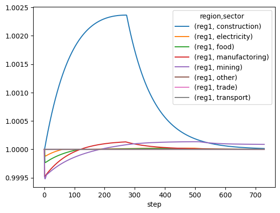

.. role:: pythoncode(code)
   :language: python

.. _boario-quickstart:

Quickstart and examples
==============================

For the following examples, we assume you have followed installation instructions.

If you encounter any problems with one of the examples bellow, please `raise an issue`_
on the repository, or `contact the developer`_.

.. _raise an issue: https://github.com/spjuhel/BoARIO/issues/new

.. _contact the developer: pro@sjuhel.org

Minimal working full example
__________________________________

In the following example, we use the "test" MRIO of the pymrio module,
which doesn't require to load additional data and has a low number of sectors and
regions, allowing fast computation.

.. code:: python

          # import pymrio for the test MRIO
          import pymrio

          # import pandas for the plot
          import pandas as pd

          # import the different classes
          from boario.simulation import Simulation  # Simulation wraps the model
          from boario.extended_models import ARIOPsiModel  # The core of the model

          # A class computing and storing indicators based on a simulation
          from boario.indicators import Indicators
          from boario.event import EventKapitalRecover  # A class defining a shock on capital

          # Load the IOSystem from pymrio
          mrio = pymrio.load_test().calc_all()

          # Instantiate the model and the simulation
          model = ARIOPsiModel(mrio)
          sim = Simulation(model)

          # Instantiate an event.
          ev = EventKapitalRebuild(
              impact=10000000,
              aff_regions=["reg1"],
              aff_sectors=["manufactoring", "mining"],
              rebuilding_sectors={"construction": 1.0},
              rebuilding_factor=1.0,
          )

          # Add the event to the simulation
          sim.add_event(ev)

          # Launch the simulation
          sim.loop()

          # You should be able to generate a dataframe of
          # the production with the following line
          df = pd.DataFrame(sim.production_evolution, columns=model.industries)

          # This allows to normalize production at its initial level
          df = df / df.loc[0]

          df.loc[:, ("reg1", slice(None))].plot()

You should get a plot looking like this one:

ARIO vs :class:`~boario.model_base.ARIOBaseModel` vs :class:`~boario.extended_models.ARIOPsiModel`
_____________________________________________________________________________________________________________

Currently, two model classes are implemented, :class:`~boario.model_base.ARIOBaseModel` and :class:`~boario.extended_models.ARIOPsiModel`.
:class:`~boario.model_base.ARIOBaseModel` is essentially a theoretical implementation used to test a "simplistic and essential" version of the model, and should not
be used directly other than for developing new variants.

:class:`~boario.extended_models.ARIOPsiModel` mostly implements the version presented in :cite:`2013:hallegatte` for the multi-regional case,
as well as (optionally) the intermediate order mechanism presented in :cite:`2020:guan`.

One mechanism currently not implemented is the `macro effect` on final demand described in :cite:`2008:hallegatte`. This mechanism should be implemented in a future update.

:class:`~pymrio.core.mriosystem.IOSystem` input
________________________________________________________

The :class:`~pymrio.core.mriosystem.IOSystem` given to instantiate a :class:`~boario.extended_models.ARIOPsiModel` has to
have intermediate demand matrix ``Z``, final demand matrix ``Y`` and gross production vector ``x`` as attributes, and be balanced.

This should be the case for all MRIO parsed with the ``pymrio`` package.
Refer to its `documentation <https://pymrio.readthedocs.io/en/latest/>`_ for more details.

.. attention::

   Note that the (region,sector) Multiindexes for the matrices and vector are reordered by BoARIO to be in lexicographic order.

.. _temporal:

Temporal dimension
______________________

The temporal dimension is an important aspect of dynamically modeling indirect economic impacts.
Historically, ARIO has been used both using weekly and daily steps, but mostly the latter case.
BoARIO's implementation of ARIO aims at being independent of the ``temporal unit``
considered, notably to study how this aspect affect results.

This means it is virtually possible to run ARIO on any temporal granularity of your choosing.

For efficiency purpose, this implementation allows to simulate only some ``temporal unit`` and interpolate in between.
Hence a ``step`` can represent multiple ``temporal units``. Although by default, a ``step`` equals a ``temporal unit`` equals a `day` and
defaults values of characteristic times and other time related variable are accordingly expressed in number of days, these three terms are conceptually
different. For this reason we will favor the term ``temporal unit`` to designate the atomic period in the model throughout this documentation.

The number of ``temporal units`` to simulate can be set when instantiating the ``Simulation`` object like so:

.. code:: python

          sim = Simulation(model, n_temporal_units_to_sim=730)

By default, simulation run for 365 `temporal units` which are days by default.

.. _model_parameters:

Changing the model parameters
__________________________________

There are multiple theoretical and implemented versions of the ARIO model, each
with various parameters. One objective of BoARIO is to offer an extensive,
modular and adaptable implementation of these versions, in order to allow easy
access to version comparison, parameters values exploration and modeling
improvement.

If you are not familiar with the model, it is strongly advised to read the :ref:`boario-math` page of this documentation,
as well as :cite:`2013:hallegatte`.

Parameters are set when instantiating the model. The following block shows all currently available parameters as well as their default value.

.. code:: python

          model = ARIOPsiModel(
              pym_mrio=mrio,
              order_type="alt",
              alpha_base=1.0,
              alpha_max=1.25,
              alpha_tau=365,
              rebuild_tau=60,
              main_inv_dur=90,
              monetary_factor=10**6,
              temporal_units_by_step=1,
              iotable_year_to_temporal_unit_factor=365,
              infinite_inventories_sect=None,
              inventory_dict=None,
              kapital_vector=self.stock_exp,
              kapital_to_VA_dict=None,
          )

Here a quick description of each parameters. Please refer to both :ref:`the mathematical description<boario-math>` and the :ref:`api-ref` for further details.

* ``order_type`` : Setting it to ``"alt"`` makes the model use the intermediate order mechanism described in :cite:`2020:guan`. Any other value makes the model use the `classic` order mechanism used in :cite:`2013:hallegatte` (see :ref:`alt_orders`)

* ``alpha_base``, ``alpha_max``, ``alpha_tau`` respectively set the base overproduction, the maximum overproduction, and its characteristic time (in `temporal unit`).

* ``rebuild_tau`` sets the default rebuilding or recovering characteristic time for events (this value is overridden if specified directly in the Event object)

* ``inventory_dict`` should be a dictionary of ``sector:duration`` format, where all sector are present and ``duration`` is both the initial and goal duration for this input stock.

* ``main_inv_dur`` sets the default initial/goal inventory duration in `temporal unit` for all sectors if inventory_dict is not given.

* ``infinite_inventories_sect`` should be a list of inputs never constraining production (the stocks for these input will be virtually infinite when considering stock constraints) (overridden by ``inventory_dict``)

* ``monetary_factor`` should be equal to the monetary factor of the MRIO used (most of the time MRIO are in millions €/$, hence the default :math:`10^6`)

* ``temporal_units_by_step`` the number of `temporal units` to simulate every step. Setting it to 5 will divide the computation time by 5, but only one every 5 `temporal units` will actually be simulated. See :ref:`temporal`.

.. _year_to_temporal_unit_factor:

* ``iotable_year_to_temporal_unit_factor`` defines the `temporal unit` assuming the MRIO contains yearly values. Note that this has not been extensively tested and should be used with care.

* ``kapital_to_VA_dict`` should be a dictionary of ``sector:ratio`` format, where ratio is an estimate of Capital Stock over Value Added ratio. This is used to estimate the capital stock of each sector. By default the ratio is 4/1 for all sectors.

* ``kapital_vector`` can directly set the capital stock for all industries (ie regions*sectors sized). This overrides ``kapital_to_VA_dict``.

.. note::

   All arguments except the mrio are keyword arguments (`ie` not positional), meaning you always need to specify <parameter = value>.
   (This also means you can put them in any order). The reason for this is to make parameter setting entirely explicit.

Reading the outputs and saving files
__________________________________________

.. _variables_evolution:

Monitoring the model variables
------------------------------

By default, simulations record the evolution of variables in temporary files, and the arrays
are accessible directly as attributes as long as the ``Simulation`` object exists.
For convenience all such attributes ends with ``_evolution``.
The arrays contains the variables values for each regions for each sector for each temporal unit.
Each row represent a temporal unit. The columns are all the possible (region,sector) tuples, ie industries,
ordered in lexicographic order.

Here is a commented list of these attributes:

.. code:: python

        # The realised production
        sim.production_evolution

        # The production capacity
        sim.production_cap_evolution

        # The share of realised production distributed to rebuilding
        sim.rebuild_production_evolution

        # The overproduction factor
        sim.overproduction_evolution

        # The (total) intermediate demand (ie how much intermediate demand was addressed to sector i in region j)
        sim.io_demand_evolution

        # The (total) final demand (note the final demand is currently fix in the model)
        sim.final_demand_evolution

        # The (total) rebuild demand
        sim.rebuild_demand_evolution

        # The amount of final demand that couldn't be satisfied
        sim.final_demand_unmet_evolution

        # The remaining amount of destroyed (ie not recovered/rebuilt) capital
        sim.regional_sectoral_kapital_destroyed_evolution

        # Note that the following array have one more dimension,
        # their shape is (temporal units, sectors, regions*sectors)
        # This one states for each temporal unit, for each input, for each (region,sector)
        # if the input was limiting production. For efficiency, information is stored as a
        # byte, -1 for False, 1 for True
        sim.limiting_inputs_evolution

It is also possible to record the inputs stocks, but this is disabled by defaults as its shape is the same as
``limiting_inputs_evolution``, but its ``dtype`` is ``float64``, which can very rapidly lead to huge files.

.. code:: python

          # Setup the recording of stocks
          sim = simulation(model, register_stocks=True)

          # Access the array
          sim.inputs_evolution

These files are raw numpy arrays (for efficiency purpose) but you can easily transform them to pandas DataFrame as ``model.industries`` stores
the relevant MultiIndex.

.. code:: python

          df = pd.DataFrame(sim.production_evolution, columns=model.industries)

.. _index_records:

Saving indexes, parameters and events simulated
-----------------------------------------------

In order to keep experiments organized and reproducible,
the following arguments can be used when instantiating a
``Simulation`` object:

* ``"save_index"`` : ``True|False``, if ``True``, save a file :file:`boario_output_dir/results/jsons/indexes.json`, where the indexes (regions, sectors, final demand categories, etc.) are stored.

* ``"save_params"`` : ``True|False``, if ``True``, save a file :file:`boario_output_dir/results/jsons/simulated_params.json`, where the simulation parameters are stored.

* ``"save_events"`` : ``True|False``, if ``True``, save a file :file:`boario_output_dir/results/jsons/simulated_events.json`, where the indexes (regions, sectors, final demand categories, etc.) are stored.

.. _recording:

Record files
-------------

By defaults the arrays recording the evolution of variables are temporary files (:ref:`variables_evolution`),
which are deleted when the ``Simulation`` object is destroyed.

It is however possible to ask the ``Simulation`` object to save any selection of these raw arrays,
by giving a list and an output directory when instantiating. Here is the complete list of variables than can be saved:

``['production_realised', 'production_capacity', 'final_demand', 'intermediate_demand', 'rebuild_demand',
'overproduction', 'final_demand_unmet', 'rebuild_prod', 'inputs_stocks', 'limiting_inputs', 'kapital_to_recover']``

.. attention::

   ``inputs_stocks`` still requires the argument ``register_stocks`` to be True in order for the file to be saved.

For example the following code will create the files ``"production_realised"`` and ``"final_demand_unmet"``
in the specified folder (or to a temporary directory prefixed by ``"boario"`` by default).

.. code:: python

          sim = Simulation(
              model,
              save_records=["production_realised", "final_demand_unmet"],
              boario_output_dir="folder of your choosing/",
          )

Files saved like this can then be read with:

.. code:: python

          import numpy as np

          # For all records except limiting_inputs and inputs_stocks
          np.memmap(
              "path/to/file",
              mode="r+",
              dtype="float64",
              shape=(n_temporal_units, n_sectors * n_regions),
          )

          # For limiting_inputs
          np.memmap(
              "path/to/file",
              mode="r+",
              dtype="byte",
              shape=(n_sectors * n_temporal_units, n_sectors * n_regions),
          )

          # For inputs_stocks
          np.memmap(
              "path/to/file",
              mode="r+",
              dtype="float64",
              shape=(n_sectors * n_temporal_units, n_sectors * n_regions),
          )

Indicators and parquet files
-------------------------------

You may also pass the ``Simulation`` object to ``indic = Indicators.from_sim()`` to create an :class:`~boario.indicators.Indicators` object,
which will among other things, generate all the pandas dataframe. These dataframes can then be accessed by ``ind.production_realised_df`` for example.

If you also specify a ``results_storage`` argument, instantiating will also produce a ``parquets`` folder at the path given
, inside which all dataframes will be stored as `parquets`_ files (which can then be read easily using :py:func:`~pandas.read_parquet`).

.. code:: python

   from boario.indicators import Indicators

   indic = Indicators.from_sim(sim, results_storage="path/to/save/results")

Calling ``indic.update_indicators()`` fills the ``indic.indicators`` dictionary with the following indicators:

- The total (whole world, all sectors) final consumption not met during the simulation ``indicator['tot_fd_unmet']``.

- The final consumption not met in the region(s) affected by the shock ``indicator['aff_fd_unmet']``.

- The rebuild duration (ie the number of step during which rebuild demand is not zero) ``indicator['rebuild_durations']``.

- If there was a shortage (``indicator['shortage_b']``), its start and end dates ``indicator['shortage_date_start']`` and ``indicator['shortage_date_end']``.

- The top five `(region,sectors)` tuples where there was the biggest absolute change of production compared to a no shock scenario.

It also produce dataframes indicators :

- The production change by region over the simulation (``indic.prod_chg_region``) giving for each region the total gain or loss in production during the simulation.

- The final consumption not met by region over the simulation (``indic.df_loss_region``) giving for each region the total loss in consumption during the simulation.

Finally calling ``indic.write_indicators(storage_path="/path/of/your/choosing")`` will write the ``indic.indicators`` dictionary to :file:`indicators/indicators.json`, as well as :file:`indicators/prod_chg.json` and :file:`indicators/fd_loss.json`. The parent folder defaults to the ``results_storage`` argument given when instantiating the ``Indicators`` object and is overridden if ``storage_path`` is specified. Note that if neither was given, an error is raised.

.. _`parquets`: https://parquet.apache.org/
.. _github repository: https://github.com/spjuhel/BoARIO
.. _here: https://zenodo.org/record/5589597
